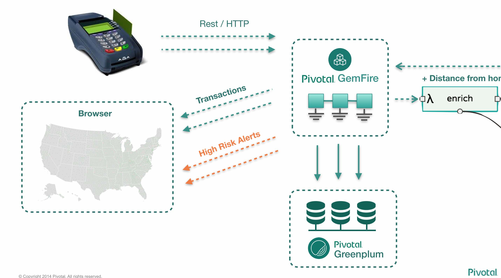
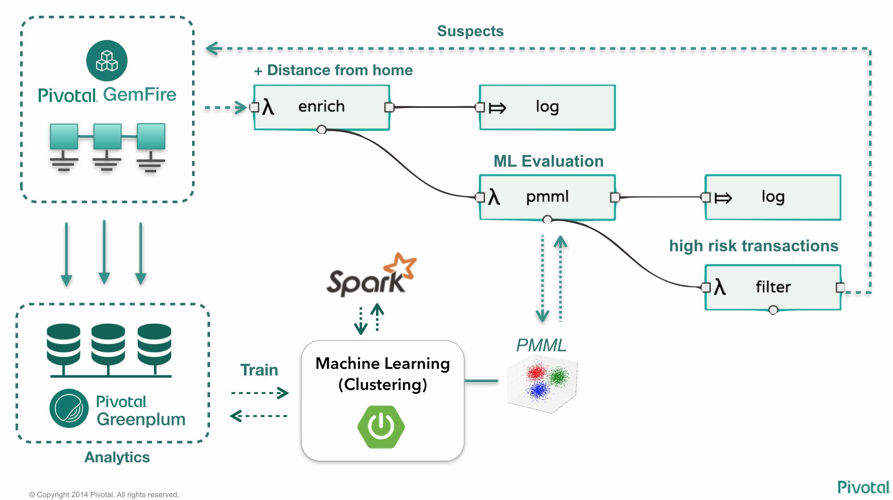
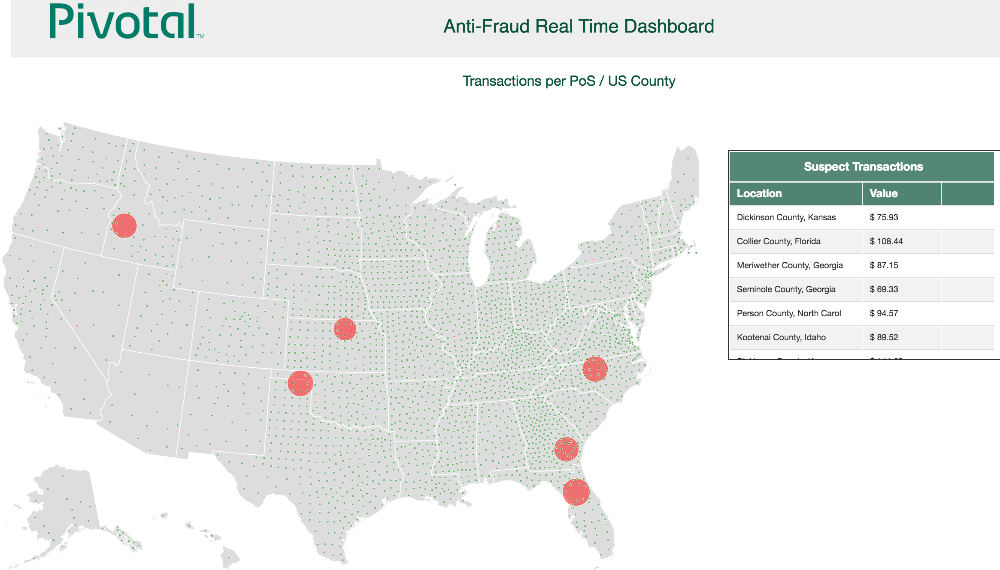

= Real-Time Fraud Detection with Microservices

=== Architecture overview

=== Requirements

  - CloudFoundry (tested with pcfdev v0.21)
  - Apache Geode (tested with v1.0.0-incubating.M2) - to be replaced by GemFire 9.0 when that is released
  - PostgreSQL (tested with 9.5.3) - to be replaced by Greenplum server once GemFire 9.0 is released
  - Spring Cloud Dataflow (tested with SCDF v1.1.0.M2, CloudFoundry Deployer v1.1.0.M1)
  - Spark-redis (tested with v0.1.1) - installed in local maven repository
  
=== Preparing the environment

* Export the variable __$GEODE_HOME__, pointing to your local GemFire / Geode server home.
* Edit the file __start-scdf-pcfdev.sh__, in order to satisfy your pcfdev environment info and SCDF binaries path
* Edit the file __GemFireServer/startup.gfsh__, replacing the IPs with your local address on the pcfdev network (default is 192.168.11.1, for the pcfdev server running on 192.168.11.11). If in doubt, check your pcfdev VM Ip address.
* Edit the file __TransactionsEmulator/src/main/resources/application.properties__, replacing the __geodeUrl__ variable with the correct Geode IP. 
* Start pcfdev, if not running yet.
* Start Greenplum (or PostgreSQL)
* Use the DDL statements in __scripts/model_postgres.sql__ to create the database model. 
* Import the data from tables using the csv files __scripts/pos_device.csv__, __scripts/zip_codes_states.csv__ and __scripts/transaction.csv__.  This step won't be necessary when GemFire 9.0 is released (it will write transactions directly to Greenplum).
* Start GemFire/Geode using the script __GemFireServer/startup.sh__ 
* Start the Spring Cloud Dataflow server (or deploy it to pcfdev, if you prefer)

=== Building SCDF apps locally (for offline demo and best performance)

* Clone the repository https://github.com/spring-cloud/spring-cloud-stream-app-starters . Cd into it.
* Build and install the repository (__./mvnw -s .settings.xml -U clean install -DskipTests__)
* Generate the apps (run ./generateApps.sh)
* Cd into the __apps__ directory.
* Build and install the apps (__mvn -s ../.settings.xml -U clean install -DskipTests__)

=== Running the demo

==== Setup

1- Create the gemfire user-provided service in CF using the script __TransactionsConsole/cf-createservice.txt__ . If necessary, modify it to point to your correct GemFire server

2- Create the gpdb user-provided service in CF using the script __ClusteringService/cf-createservice.txt__ . If necessary, modify it to point to your correct Greenplum/PostgreSQL server

3- Create a RabbitMQ service on CF called "rabbit". This will be our SCDF transport.
----
Frederico-Melos-MacBook-Pro:FraudDetection-DataMicroservices fmelo$ cf create-service p-rabbitmq standard rabbit
Creating service instance rabbit in org pcfdev-org / space pcfdev-space as admin...
OK
----
4- Create a Redis service on CF called "redis". This will be used by both the ML Clustering app and the custom enricher

----
Frederico-Melos-MacBook-Pro:FraudDetection-DataMicroservices fmelo$ cf create-service p-redis shared-vm redis
Creating service instance redis in org pcfdev-org / space pcfdev-space as admin...
OK
----

5- Push the app TransactionsConsole to CF. There's a __manifest.yml__ file on the application root folder.

6- Open the TransactionsConsole UI (see the CF assigned host, probably http://transactions-console.local.pcfdev.io) and notice the US Map. 

7- Now start the TransactionsEmulator app.  You can run __"./gradlew bootRun"__ to start it.  Wait for it to be done with loading the devices and transactions start to be posted.

8- Switch back to the TransactionsConsole UI and see transactions happening.

==== Creating and training the Machine Learning model

9- Push the application ClusteringService to CF. There's a __manifest.yml__ file on the application root folder.

10- Once the app is running, trigger the model training by accessing the __/clustering/train__ URL (probably http://clustering-service.local.pcfdev.io/clustering/train).  Check the CF logs for that app and see spark querying Greenplum/PostgreSQL and building the model.  It will take a few minutes until the model is trained and the URL will return a few numbers.

11- Now the model is trained, check its PMML representation using the url __/clustering/model.pmml.xml__ (http://clustering-service.local.pcfdev.io/clustering/model.pmml.xml)

12- Notice the clusters assigned on the three __<cluster>__ tags by the bottom of the XML. Each cluster is a combination of average values for __"distance from home location"__ and __"transaction value"__ variables. The cluster with the lowest values is likely the one assigned to __low risk transactions__.

When evaluating the PMML model, each transaction will be assigned to the closest cluster, based on its distance from the home location (where customer does most transactions) and transaction value.

==== Creating the first two streams in SCDF 

13- Using the SCDF shell, import the common applications by running

----
dataflow:>app import --uri file:////Users/fmelo/FraudDetection-DataMicroservices/scripts/scdf-stream-apps.properties 

Successfully registered applications: [source.tcp, sink.jdbc, source.http, sink.rabbit, source.rabbit, source.ftp, sink.gpfdist, processor.transform, source.sftp, processor.filter, source.file, sink.cassandra, processor.groovy-filter, sink.router, source.trigger, sink.hdfs-dataset, processor.splitter, source.load-generator, sink.file, source.time, source.gemfire, source.twitterstream, sink.tcp, source.jdbc, sink.field-value-counter, sink.redis-pubsub, sink.hdfs, processor.bridge, processor.pmml, processor.httpclient, source.s3, sink.ftp, sink.log, sink.gemfire, sink.aggregate-counter, sink.throughput, source.triggertask, source.gemfire-cq, source.jms, processor.scriptable-transform, sink.counter, sink.websocket, source.mail, processor.groovy-transform, source.syslog]
----

Make sure you replace the path in the command with your correct file location.

14- Build and install (./gradlew build install) the Enricher-processor application and register it with SCDF.

----
dataflow:>app register --name enrich --type processor --uri maven://io.pivotal.demo:enricher-processor:1.0.0.BUILD-SNAPSHOT --force
Successfully registered application 'processor:enrich'
----

15- Create the first streams on either the SCDF Shell or the SCDF UI.  On the UI, use the following DSL:

----
fromgem = gemfire --region-name=Transaction --host-addresses=geode-server:10334 | enrich | log

eval = :fromgem.enrich > pmml --modelLocation=http://clustering-service.local.pcfdev.io/clustering/model.pmml.xml --inputs='field_0=payload.distance.doubleValue(),field_1=payload.value.doubleValue()'  --inputType='application/x-spring-tuple' --outputType='application/json' | log

----

Replace the host-addresses parameter with your GemFire locator information on the first flow.
Notice in the second flow we're mapping the PMML model inputs in the PMML XML file with the properties in our enriched payload. Make sure the modelLocation variable has the right URL to your PMML model endpoint. 

==== Deploying the first stream - enriching the payload

16- Deploy the first flow and see now you have three new applications running on CF

----
Frederico-Melos-MacBook-Pro:FraudDetection-DataMicroservices fmelo$ cf apps
Getting apps in org pcfdev-org / space pcfdev-space as admin...
OK

name                       requested state   instances   memory   disk   urls
webconsole                 started           1/1         512M     512M   transactions-console.local.pcfdev.io
clustering-service         started           1/1         1G       512M   clustering-service.local.pcfdev.io
dataflow-fromgem-log       started           1/1         512M     512M   dataflow-fromgem-log.local.pcfdev.io
dataflow-fromgem-enrich    started           1/1         512M     512M   dataflow-fromgem-enrich.local.pcfdev.io
dataflow-fromgem-gemfire   started           1/1         512M     512M   dataflow-fromgem-gemfire.local.pcfdev.io
----

17- Once the apps are running, start tailing the logs of the "dataflow-fromgem-log" app and then run the TransactionsEmulator again (see step 7 above). You should start seeing transactions + enriched data being logged.

----
Frederico-Melos-MacBook-Pro:FraudDetection-DataMicroservices fmelo$ cf logs dataflow-fromgem-log
Connected, tailing logs for app dataflow-fromgem-log in org pcfdev-org / space pcfdev-space as admin...

2016-06-22T17:28:50.52-0700 [APP/0]      OUT 2016-06-23 00:28:50.515  INFO 14 --- [nrich.fromgem-1] log.sink                                 : {"id":8662602513688694487,"deviceId":10,"value":-1.345934346296312E64,"accountId":-61,"timestamp":1008806322260060363,"homeLocation":null,"homeLatitude":0.0,"homeLongitude":0.0,"distance":0.0}
2016-06-22T17:28:50.61-0700 [APP/0]      OUT 2016-06-23 00:28:50.611  INFO 14 --- [nrich.fromgem-1] log.sink                                 : {"id":5199577666956545635,"deviceId":12,"value":1.599846306874403E-148,"accountId":-102,"timestamp":432345569956636875,"homeLocation":null,"homeLatitude":0.0,"homeLongitude":0.0,"distance":0.0}
2016-06-22T17:28:50.66-0700 [APP/0]      OUT 2016-06-23 00:28:50.657  INFO 14 --- [nrich.fromgem-1] log.sink                                 : {"id":7175376153652552608,"deviceId":6,"value":1.8057620689412976E218,"accountId":51,"timestamp":504403163994564811,"homeLocation":"32.373788:-86.289182","homeLatitude":32.373788,"homeLongitude":-86.289182,"distance":63.24}
2016-06-22T17:28:50.71-0700 [APP/0]      OUT 2016-06-23 00:28:50.708  INFO 14 --- [nrich.fromgem-1] log.sink                                 : {"id":7442228185422431077,"deviceId":2,"value":3.567804161380589E-105,"accountId":82,"timestamp":1945555044753123532,"homeLocation":"39.787529:-98.20595","homeLatitude":39.787529,"homeLongitude":-98.20595,"distance":1429.1}

----

Notice the "homeLocation" and "distance" attributes on the payload. They were added by the enricher processor.

==== Deploying the second stream to SCDF - evaluating against the PMML model

18- Deploy the second stream (__eval__)  and see now you have two new applications running on CF

----
Frederico-Melos-MacBook-Pro:FraudDetection-DataMicroservices fmelo$ cf apps
Getting apps in org pcfdev-org / space pcfdev-space as admin...
OK

name                       requested state   instances   memory   disk   urls
webconsole                 started           1/1         512M     512M   transactions-console.local.pcfdev.io
clustering-service         started           1/1         1G       512M   clustering-service.local.pcfdev.io
dataflow-fromgem-log       started           1/1         512M     512M   dataflow-fromgem-log.local.pcfdev.io
dataflow-fromgem-enrich    started           1/1         512M     512M   dataflow-fromgem-enrich.local.pcfdev.io
dataflow-fromgem-gemfire   started           1/1         512M     512M   dataflow-fromgem-gemfire.local.pcfdev.io
dataflow-eval-log          started           1/1         512M     512M   dataflow-eval-log.local.pcfdev.io
dataflow-eval-pmml         started           1/1         512M     512M   dataflow-eval-pmml.local.pcfdev.io
----

19- Once the apps are running, start tailing the logs of the "dataflow-eval-log" app and then run the TransactionsEmulator again (see step 7 above). You should now see the first results of the PMML model evaluation

----
Frederico-Melos-MacBook-Pro:FraudDetection-DataMicroservices fmelo$ cf logs dataflow-eval-log 
Connected, dumping recent logs for app dataflow-eval-log in org pcfdev-org / space pcfdev-space as admin...

2016-06-22T17:28:50.58-0700 [APP/0]      OUT 2016-06-23 00:28:50.582  INFO 15 --- [val.pmml.eval-1] log.sink                                 : {"id":8662602513688694487,"deviceId":10,"value":-1.345934346296312E64,"accountId":-61,"timestamp":1008806322260060363,"homeLocation":null,"homeLatitude":0.0,"homeLongitude":0.0,"distance":0.0,"_output":{"result":"1","type":"DISTANCE","entityRegistry":{"1":{"locator":null,"id":null,"name":"cluster_0","size":null,"extensions":[],"kohonenMap":null,"array":{"locator":null,"n":2,"type":"REAL","value":"27.685449231686356 3.349155420943788"},"partition":null,"covariances":null},"2":{"locator":null,"id":null,"name":"cluster_1","size":null,"extensions":[],"kohonenMap":null,"array":{"locator":null,"n":2,"type":"REAL","value":"32.16548772032409 2.544008885888239"},"partition":null,"covariances":null},"3":{"locator":null,"id":null,"name":"cluster_2","size":null,"extensions":[],"kohonenMap":null,"array":{"locator":null,"n":2,"type":"REAL","value":"27.691067777235084 1.7439567824479112"},"partition":null,"covariances":null}},"entity":{"locator":null,"id":null,"name":"cluster_0","size":null,"extensions":[],"kohonenMap":null,"array":{"locator":null,"n":2,"type":"REAL","value":"27.685449231686356 3.349155420943788"},"partition":null,"covariances":null},"categoryValues":["1","2","3"],"entityIdRanking":["1","2","3"],"affinityRanking":[1.811539264540081E128,1.811539264540081E128,1.811539264540081E128],"entityAffinity":1.811539264540081E128,"displayValue":"cluster_0","entityId":"1"}}
2016-06-22T17:28:50.59-0700 [APP/0]      OUT 2016-06-23 00:28:50.591  INFO 15 --- [val.pmml.eval-1] log.sink                                 : {"id":5199577666956545635,"deviceId":12,"value":1.599846306874403E-148,"accountId":-102,"timestamp":432345569956636875,"homeLocation":null,"homeLatitude":0.0,"homeLongitude":0.0,"distance":0.0,"_output":{"result":"3","type":"DISTANCE","entityRegistry":{"1":{"locator":null,"id":null,"name":"cluster_0","size":null,"extensions":[],"kohonenMap":null,"array":{"locator":null,"n":2,"type":"REAL","value":"27.685449231686356 3.349155420943788"},"partition":null,"covariances":null},"2":{"locator":null,"id":null,"name":"cluster_1","size":null,"extensions":[],"kohonenMap":null,"array":{"locator":null,"n":2,"type":"REAL","value":"32.16548772032409 2.544008885888239"},"partition":null,"covariances":null},"3":{"locator":null,"id":null,"name":"cluster_2","size":null,"extensions":[],"kohonenMap":null,"array":{"locator":null,"n":2,"type":"REAL","value":"27.691067777235084 1.7439567824479112"},"partition":null,"covariances":null}},"entity":{"locator":null,"id":null,"name":"cluster_2","size":null,"extensions":[],"kohonenMap":null,"array":{"locator":null,"n":2,"type":"REAL","value":"27.691067777235084 1.7439567824479112"},"partition":null,"covariances":null},"categoryValues":["1","2","3"],"entityIdRanking":["3","1","2"],"affinityRanking":[769.8366199024732,777.7009411939198,1041.090581497798],"entityAffinity":769.8366199024732,"displayValue":"cluster_2","entityId":"3"}}
----

Notice the added variable ___output__ and its __result__ mapping to a cluster number. You can also find information about the cluster mapping algorithm used (euclidean distance) and information about each cluster by their numbers.
*The value of ___output.result__ for each transaction is one of the clusters (starting at 1) defined at the trained model (see step 12 above)*

==== Deploying the third stream to SCDF - filtering high-risk transactions and inserting back to GemFire

20- Create and deploy the third stream to SCDF, called __result__

----
result = :eval.pmml > filter --expression=payload._output.result.toString().equals('2')  | gemfire --region-name=Suspect --host-addresses=geode-server:10334 --keyExpression=payload.id.toString()
----

Notice we're filtering only the transactions which are mapped to cluster number 3 in this example. Make sure you filter by a cluster number which is receiving a good amount of transactions, so you can show them in the TransactionsConsole app.

Notice the new applications deployed to CF by this new stream. 

21- Now run the TransactionsEmulator once more (check step 7) and check the TransactionsConsole UI. You should see some red/orange transactions in the map and their information on the associated box.

In case you were successful until this point and haven't seen the flagged transactions coming in the UI:
* Check the logs for the new two apps deployed by the third stream
* Redeploy the third stream, filtering by a different cluster.

